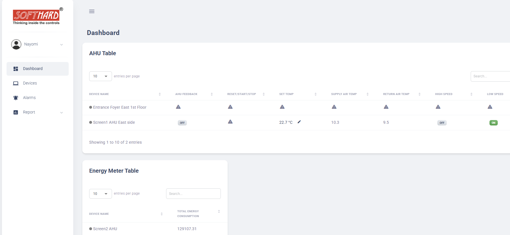
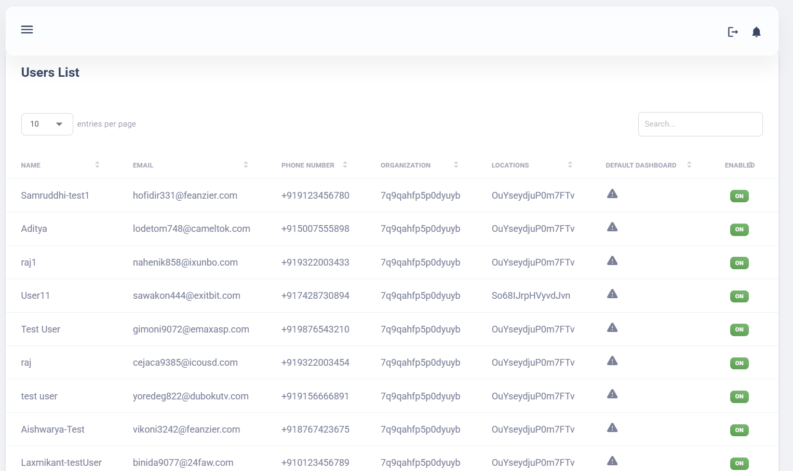
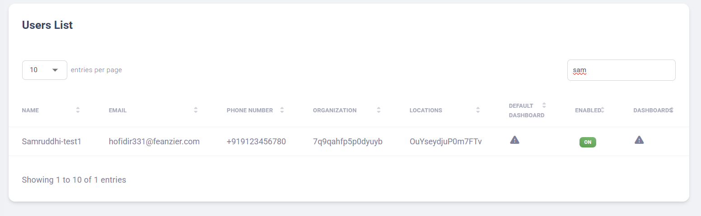
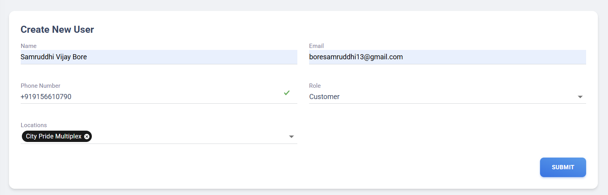

# Centralized User Management Lambda using AWS SAM

# Table Of Contents

1. [Local Setup](#1-local-setup)
2. [Introduction](#2-introduction)
3. [Interfaces](#3-interfaces)
   1. [GET-users](#31-get-users)
   2. [GET-userDetails](#32-get-userdetails)
   3. [GET locations](#33-get-locations)
   4. [GET userByOrgId](#34-get-userbyorgid)
   5. [POST userByOrgId](#35-post-userbyorgid)
4. [Responses of API Endpoints before and after Migration](#4-responses-of-api-endpoints-before-and-after-migration)


# 1.Local Setup
### Local DynamoDB Setup
Testing this lambda need a local setup of dynamoDB tables required for functioning of this lambda. This section explains how to set up DynamoDB locally using Docker, create required tables, export data from AWS, and import it into the local instance.

### ✅ Step 1 — Run DynamoDB Local in Docker
```bash
docker run -d \
  -p 8000:8000 \
  --name dynamodb-local \
  amazon/dynamodb-local
```
After this, DynamoDB Local will be available at:

```bash
http://localhost:8000
```

### ✅ Step 2 — Create Tables in Local DynamoDB
Create dev-iotPlatform-users table
```bash
aws dynamodb create-table \
  --table-name dev-iotPlatform-users \
  --attribute-definitions \
    AttributeName=id,AttributeType=S \
    AttributeName=orgId,AttributeType=S \
  --key-schema \
    AttributeName=id,KeyType=HASH \
    AttributeName=orgId,KeyType=RANGE \
  --billing-mode PAY_PER_REQUEST \
  --endpoint-url http://localhost:8000
```

### ✅ Step 3 — Export Data from AWS DynamoDB
Run these commands (with AWS CLI configured):

Export Users table:
```bash
aws dynamodb scan \
  --table-name dev-iotPlatform-users \
  --output json > users-aws-data.json
```
This will generate:

```bash
users-aws-data.json
```

### ✅ Step 4 — Import Data into Local DynamoDB

4.1 Create Import Script
```bash
touch import-users.js
```

4.2 Install Dependency (Dev Only)
```bash
npm install --save-dev @aws-sdk/client-dynamodb
```
Why --save-dev?

Used only for local tooling
Not required in Lambda runtime
Keeps production bundle clean

4.3 Sample Import Script
```bash
import fs from "fs";
import { DynamoDBClient, BatchWriteItemCommand } from "@aws-sdk/client-dynamodb";

const client = new DynamoDBClient({
  region: "ap-south-1",
  endpoint: "http://localhost:8000",
});
const data = JSON.parse(fs.readFileSync("users-aws-data.json", "utf8"));
const items = data.Items;

const CHUNK_SIZE = 25;

for (let i = 0; i < items.length; i += CHUNK_SIZE) {
  const chunk = items.slice(i, i + CHUNK_SIZE);
  const request = {
    RequestItems: {
      "dev-iotPlatform-users": chunk.map((item) => ({
        PutRequest: { Item: item },
      })),
    },
  };
  await client.send(new BatchWriteItemCommand(request));
  console.log(`Imported ${i + chunk.length}/${items.length}`);
}
```

Run: node import-users.js

Verify import:
```bash
aws dynamodb scan \
  --table-name dev-iotPlatform-users \
  --endpoint-url http://localhost:8000 \
  --limit 5
```

### ✅ Step 5 — Configure template.yaml for Local Development and change the dynamo endpoint in DynamoService.js
```bash
Environment:
  Variables:
    IS_LOCAL: "true"
    DYNAMODB_ENDPOINT: "http://host.docker.internal:8000"
```

# **2.Introduction** 

The User Management Lambda is responsible for handling user-related operations within the platform, including user creation, retrieval, updates, and user access management. It supports organization-level user administration and ensures controlled access to platform features through role-based authorization.

The Lambda is invoked via HTTP API endpoints exposed through Amazon API Gateway and triggered by the application UI. Authentication and authorization are handled using AWS Cognito, while user metadata, role assignments, organization mappings, and configuration details are stored and managed using Amazon DynamoDB.

This documentation outlines the available interfaces, supported API endpoints, and their functional behavior following the migration of the User Management Lambda to AWS SAM. The migration focuses on infrastructure standardization, deployment consistency, and local development support using AWS SAM, without introducing any changes to existing business logic, authorization rules, or UI behavior.

##  **User Management Lambda – Roles and Responsibilities**

The User Management Lambda acts as a centralized service for managing users within the platform. Its key responsibilities include:

* **Creating and managing users** – Adds new users under an organization, assigning roles, attributes, and permissions to ensure proper access.

* **Retrieving user details** – Fetches individual or organization-scoped user information for administration and auditing purposes.

* **Updating user attributes and roles** – Modifies user attributes such as dashboards and location assignments based on authorized actions.

* **Deleting or deactivating users** – Safely deactivates or removes it includes backend support for deleting users via a dedicated API. 

Additionally, it enforces role-based access control by leveraging Cognito authentication claims in combination with backend authorization logic, ensuring secure and controlled access to platform features. Overall, this Lambda provides a **centralized, consistent, and secure way to manage user lifecycles and permissions** across the application.

---

# **3.Interfaces** 

The **User Management Lambda** is primarily invoked through **HTTP API endpoints** exposed via API Gateway. These interfaces support user-driven actions initiated from the application UI as well as backend-level user management operations.

**Invocation via UI (HTTP API Endpoints)**

When triggered through API endpoints, the User Management Lambda handles:

* Creating users within an organization  
* Retrieving organization-level and individual user details  
* Updating existing user information  
* Deleting users based on authorization and role permissions

These endpoints are both **read-oriented and write-oriented**, enabling controlled and scalable user management while keeping the UI aligned with current functional requirements.

---

## **List of Endpoints**

| URL | Method | Role | Summary | References |
| :---: | :---: | ----- | :---: | :---: |
| /api/v1/users | GET |  Customer | Fetches users associated with the requester’s organization or identity. | UI — Users List |
| /api/v1/users/userDetails | GET |  Customer | Retrieves detailed information of a specific user. | UI – UserDetails |
| /api/v1/users/locations | GET |  Customer | Fetches the locations associated with the logged-in user. | UI – Locations |
| /api/v1/organizations/{organizationId}/users | GET | Admin | Fetches all users within the specified organization for admin view. | UI – Org Users |
| /api/v1/organizations/{organizationId}/users | POST | Admin | Creates a new user in the specified organization. | UI – Create User |

## **3.1. GET  /api/v1/users** 

**Role:** Customer  
**Reference:** UI – Users List

**Functionality:**

* Retrieves a list of all users associated with the authenticated user’s **organization**.  
* Organization context is derived from the user’s authentication token (JWT from AWS Cognito).

**UI Behaviour:**

* Invoked when an IoT Admin navigates to the **Users** section in the application.  
* Displays a table or list of users with basic information such as name and email the count of number of users.  
   

  

##  **3.2 GET /api/v1/users/userDetails**

**Role:** Customer  
 **Reference:** UI – User Profile

**Functionality:**

* Retrieves details of the **currently authenticated user**.

* Fetches user attributes from the User table and enriches the response with organization details using the authentication token.

**UI Behaviour:**

* Called when the user opens the User section having create user and manage user.  
* Displays user-specific information such as name, email, phone number, locations, and organization details,etc.  
* Data is loaded automatically without any user action.



## **3.3. GET /api/v1/users/locations** 

**Role:** Customer  
 **Reference:** UI – Locations

**Functionality:**

* Returns **locations assigned to the authenticated customer user**.  
* Location data comes from the **Location Management service**.

**UI Behaviour:**

* Triggered when the user views **assigned locations**.  
* Displays a list of locations the user has access to.  
* If no locations are assigned, a message is shown.

##  **3.4 GET /api/v1/organizations/{organizationId}/users** 

**Role:** IoT Admin  
 **Reference:** UI – Organization Users

**Functionality:**

* Retrieves **all users under a specific organization**, identified by organizationId.

*  **Key operations performed by the lambda:**

* Reads organizationId from the path parameter  
* Queries the **User DynamoDB table** using the orgId GSI  
* Fetches all users mapped to the given organization  
* Returns user data along with table metadata for UI rendering

**UI Behaviour:**

* Triggered when an admin opens the **Organization Users** page.  
* Displays a list of users associated with the selected organization.  
* Used for viewing and managing organization-level users.




##  **3.5 POST /api/v1/organizations/{organizationId}/users** 

**Role:** IoT Admin  
 **Reference:** UI – Organization Users

**Functionality:**

* This API is used to **create a new user under a specific organization**.  
* **Key operations performed by the lambda:**  
    
* Reads user details from the request body  
* Validates role to prevent **admin user creation**  
* Creates the user in **Amazon Cognito** (or mocks creation in local mode)  
* Stores user metadata in the **User DynamoDB table**  
* Associates the user with the provided organization

**UI Behaviour:**

* Triggered when an IoT Admin fills and submits the **Create User form** within the organization management section.  
* Validates input fields (name, email, role) and confirms successful creation.




---

# 

# 

# **4.Responses of API Endpoints before and after Migration**  

**1. GET-  /api/v1/users**

**Before:**  

```json
{
	"statusCode": 200,
	"count": 13,
	"data": {
    	"hofidir331@feanzier.com": {
        	"name": "Samruddhi-test1"
    	},
    	"lodetom748@cameltok.com": {
        	"name": "Aditya"
    	},
    	"nahenik858@ixunbo.com": {
        	"name": "raj1"
    	},
    	"sawakon444@exitbit.com": {
        	"name": "User11"
    	},
    	"gimoni9072@emaxasp.com": {
        	"name": "Test User"
    	},
    	"cejaca9385@icousd.com": {
        	"name": "raj"
    	},
    	"yoredeg822@dubokutv.com": {
        	"name": "test user"
    	},
    	"vikoni3242@feanzier.com": {
        	"name": "Aishwarya-Test"
    	},
    	"binida9077@24faw.com": {
        	"name": "Laxmikant-testUser"
    	},
    	"jeniwi3846@kimdyn.com": {
        	"name": "Nayomi"
    	},
    	"janoge1686@hudisk.com": {
        	"name": "Abhay-test-02"
    	},
    	"abhay.shitole@softhard.in": {
        	"name": "Abhay-test-01"
    	},
    	"kasod81180@forexru.com": {
        	"name": "User21"
    	}
	}
}
```

**After:**

```json
{
    "count": 13,
    "users": {
        "nahenik858@ixunbo.com": {
            "name": "raj1"
        },
        "janoge1686@hudisk.com": {
            "name": "Abhay-test-02"
        },
        "yoredeg822@dubokutv.com": {
            "name": "test user"
        },
        "lodetom748@cameltok.com": {
            "name": "Aditya"
        },
        "gimoni9072@emaxasp.com": {
            "name": "Test User"
        },
        "binida9077@24faw.com": {
            "name": "Laxmikant-testUser"
        },
        "abhay.shitole@softhard.in": {
            "name": "Abhay-test-01"
        },
        "cejaca9385@icousd.com": {
            "name": "raj"
        },
        "sawakon444@exitbit.com": {
            "name": "User11"
        },
        "kasod81180@forexru.com": {
            "name": "User21"
        },
        "hofidir331@feanzier.com": {
            "name": "Samruddhi-test1"
        },
        "jeniwi3846@kimdyn.com": {
            "name": "Nayomi"
        },
        "vikoni3242@feanzier.com": {
            "name": "Aishwarya-Test"
        }
    }
}
```


**2\. GET-  /api/v1/users/userDetails**

 **Before:**  

```json
{
	"data": {
    	"phoneNumber": "+918765340876",
    	"locations": [
        	"OuYseydjuP0m7FTv"
    	],
    	"createdAt": 1751260638961,
    	"isEnabled": true,
    	"id": "31231d2a-10d1-7096-3163-947f83cadbcc",
    	"email": "jeniwi3846@kimdyn.com",
    	"name": "Nayomi",
    	"dashboards": [
        	"DDN059W7p1gB1cfJ"
    	],
    	"defaultDashboard": "DDN059W7p1gB1cfJ",
    	"orgId": "7q9qahfp5p0dyuyb",
    	"organization": {
        	"id": "7q9qahfp5p0dyuyb",
        	"name": "DEV - City Pride Multiplex & Ferrocare",
        	"details": {
            	"address": "Satara Road, Pune",
            	"contactNo": "9876543456"
        	}
    	}
	},
	"statusCode": 200
}
```

 **After:**  

```json
{
    "createdAt": 1751260638961,
    "phoneNumber": "+918765340876",
    "isEnabled": true,
    "name": "Nayomi",
    "locations": [
        "OuYseydjuP0m7FTv"
    ],
    "id": "31231d2a-10d1-7096-3163-947f83cadbcc",
    "defaultDashboard": "DDN059W7p1gB1cfJ",
    "dashboards": [
        "DDN059W7p1gB1cfJ"
    ],
    "orgId": "7q9qahfp5p0dyuyb",
    "email": "jeniwi3846@kimdyn.com",
    "organization": {
        "id": "7q9qahfp5p0dyuyb",
        "name": "DEV - City Pride Multiplex & Ferrocare",
        "details": {
            "address": "Satara Road, Pune",
            "contactNo": "9876543456"
        }
    }
}
```

**3\. GET-  /api/v1/users/locations**

**After:**  

```json
{
    "message": "Locations retrieved successfully",
    "data": [
        {
            "orgId": "7q9qahfp5p0dyuyb",
            "timezone": "Asia/Kolkata",
            "details": {
                "latitude": 18.488756822417574,
                "longitude": 73.8578726840346
            },
            "name": "City Pride Multiplex",
            "id": "OuYseydjuP0m7FTv"
        }
    ],
    "count": 1
}
```

**4\. GET-  /api/v1/organizations/{organizationid}/users**

 **Before:**  

```json
{
    "statusCode": 200,
    "count": 14,
    "data": {
        "tableParamMetadata": {
            "name": {
                "label": "Name",
                "columnType": "READ"
            },
            "email": {
                "label": "Email",
                "columnType": "READ"
            },
            "phoneNumber": {
                "label": "Phone Number",
                "columnType": "READ"
            },
            "orgId": {
                "label": "Organization",
                "columnType": "READ"
            },
            "locations": {
                "label": "Locations",
                "columnType": "READ"
            },
            "defaultDashboard": {
                "label": "Default Dashboard",
                "columnType": "READ"
            },
            "isEnabled": {
                "label": "Enabled",
                "columnType": "READ_BOOLEAN"
            },
            "dashboards": {
                "label": "Dashboards",
                "columnType": "READ"
            }
        },
        "parameters": [
            {
                "email": "hofidir331@feanzier.com",
                "id": "91b30d7a-00f1-70a9-2d1e-a4212fb004c4",
                "createdAt": 1768458412554,
                "orgId": "7q9qahfp5p0dyuyb",
                "name": "Samruddhi-test1",
                "phoneNumber": "+919123456780",
                "locations": [
                    "OuYseydjuP0m7FTv"
                ],
                "isEnabled": true
            }....
             ....
             ....
            {
                "name": "User21",
                "createdAt": 1753423823112,
                "orgId": "7q9qahfp5p0dyuyb",
                "id": "51338dca-2061-709e-2f30-24a92bb927f2",
                "email": "kasod81180@forexru.com",
                "phoneNumber": "+917428723247",
                "locations": [
                    "OuYseydjuP0m7FTv"
                ],
                "isEnabled": true
            }
        ]
    }
}
```

**After:**

```json
{
    "count": 14,
    "tableParamMetadata": {
        "name": {
            "label": "Name",
            "columnType": "READ"
        },
        "email": {
            "label": "Email",
            "columnType": "READ"
        },
        "phoneNumber": {
            "label": "Phone Number",
            "columnType": "READ"
        },
        "orgId": {
            "label": "Organization",
            "columnType": "READ"
        },
        "locations": {
            "label": "Locations",
            "columnType": "READ"
        },
        "defaultDashboard": {
            "label": "Default Dashboard",
            "columnType": "READ"
        },
        "isEnabled": {
            "label": "Enabled",
            "columnType": "READ_BOOLEAN"
        },
        "dashboards": {
            "label": "Dashboards",
            "columnType": "READ"
        }
    },
    "parameters": [
        {
            "createdAt": 1769346281040,
            "phoneNumber": "+919322003433",
            "isEnabled": true,
            "name": "raj1",
            "locations": [
                "OuYseydjuP0m7FTv"
            ],
            "id": "b1b3dd0a-60b1-70c1-34d2-25ad9e7f47f0",
            "orgId": "7q9qahfp5p0dyuyb",
            "email": "nahenik858@ixunbo.com"
        }        {
            "createdAt": 1767676358561,
            "phoneNumber": "+915007555898",
            "isEnabled": true,
            "name": "Aditya",
            "locations": [
                "OuYseydjuP0m7FTv"
            ],
            "id": "21635d0a-6051-701f-fc62-ee1fc193cd29",
            "orgId": "7q9qahfp5p0dyuyb",
            "email": "lodetom748@cameltok.com"
        }....
         ....
         ....
        
        {
            "createdAt": 1767969276466,
            "phoneNumber": "+918767423675",
            "isEnabled": true,
            "name": "Aishwarya-Test",
            "locations": [
                "OuYseydjuP0m7FTv"
            ],
            "id": "11b3ad5a-d0a1-707f-0945-c666bf3606b5",
            "orgId": "7q9qahfp5p0dyuyb",
            "email": "vikoni3242@feanzier.com"
        }
    ]
}
```

**5\. POST-  /api/v1/organizations/{organizationid}/users**

**Before**:

```json
{
	"statusCode": 200,
	"count": 13,
	"data": {
    	"tableParamMetadata": {
        	"name": {
            	"label": "Name",
            	"columnType": "READ"
        	},
        	"email": {
            	"label": "Email",
            	"columnType": "READ"
        	},
        	"phoneNumber": {
            	"label": "Phone Number",
            	"columnType": "READ"
        	},
        	"orgId": {
            	"label": "Organization",
            	"columnType": "READ"
        	},
        	"locations": {
            	"label": "Locations",
            	"columnType": "READ"
        	},
        	"defaultDashboard": {
            	"label": "Default Dashboard",
            	"columnType": "READ"
        	},
        	"isEnabled": {
            	"label": "Enabled",
            	"columnType": "READ_BOOLEAN"
        	},
        	"dashboards": {
            	"label": "Dashboards",
            	"columnType": "READ"
        	}
    	},
    	"parameters": [
        	{
            	"email": "hofidir331@feanzier.com",
            	"id": "91b30d7a-00f1-70a9-2d1e-a4212fb004c4",
            	"createdAt": 1768458412554,
            	"orgId": "7q9qahfp5p0dyuyb",
            	"name": "Samruddhi-test1",
            	"phoneNumber": "+919123456780",
            	"locations": [
                    "OuYseydjuP0m7FTv"
            	],
            	"isEnabled": true
        	}....
            .... 
            ....
        	{
            	"name": "User21",
            	"createdAt": 1753423823112,
            	"orgId": "7q9qahfp5p0dyuyb",
            	"id": "51338dca-2061-709e-2f30-24a92bb927f2",
            	"email": "kasod81180@forexru.com",
            	"phoneNumber": "+917428723247",
            	"locations": [
                    "OuYseydjuP0m7FTv"
            	],
            	"isEnabled": true
       }
    	]
	}
}
```

 **After:**  
```json
{
     "message": "User created successfully",
     "data":{
	   "userId": "local-user-1769964417492"
     }
}

